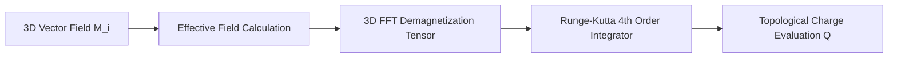

# OOMMF — Micromagnetic Vector Field Architecture Specification

## 1. Landau-Lifshitz-Gilbert (LLG) Solver
Models 3D magnetic spin precession and damping on a discrete cubic lattice:

$$\frac{\partial \mathbf{M}}{\partial t} = -\gamma \mathbf{M} \times \mathbf{H}_{\text{eff}} + \frac{\alpha}{M_s} \left( \mathbf{M} \times \frac{\partial \mathbf{M}}{\partial t} \right)$$

## 2. Dual Authorship
- **Жирняк (Jirnyak)** — Lead Micromagnetic Physicist.
- **Адольф Петушков (Adolf Petushkov)** — Systems & Numerical Architecture.
