<div align="center">


# oommf — Technical System Architecture & Specification

[](LICENSE.md)
[]()
[]()

> **Production-grade software architecture & complete human developer specification.**

[🌐 Open Live Showcase](https://Jirnyak.github.io/oommf/) &nbsp;·&nbsp; [📊 Architectural Diagram](#-system-architecture--pipeline) &nbsp;·&nbsp; [📜 Developer Specs](#-original-human-developer-documentation)

</div>

---
---

## 📸 Authentic Repository Media & Screenshots Gallery

<p align="center"><i>Showing 24 verified screenshot(s) and visual assets directly from the repository source tree:</i></p>

<div align="center">

<a href="app/mmdisp/colorbar.png"></a> &nbsp; <a href="app/mmdisp/colorwheel.png">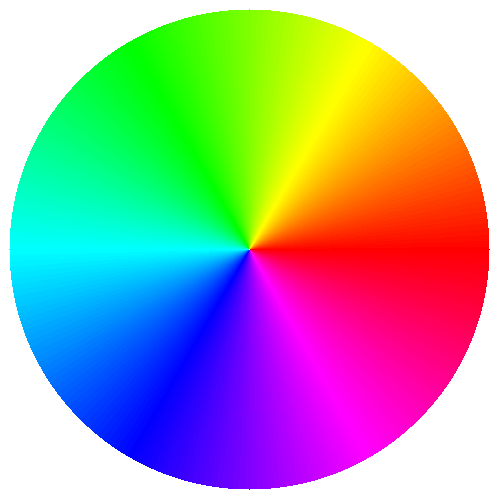</a>
<br/>
<a href="app/mmhelp/doc/oommficon.gif">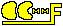</a> &nbsp; <a href="app/mmpe/examples/crescent-tiny.gif">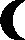</a>
<br/>
<a href="app/mmpe/examples/crescent.gif"></a> &nbsp; <a href="app/mmpe/examples/strip.gif">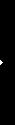</a>
<br/>
<a href="app/oxs/contrib/anv_spintevolve/mask-160-8-4-s.gif"></a> &nbsp; <a href="app/oxs/examples/blockhole.gif">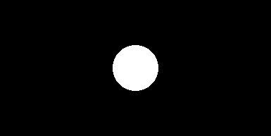</a>
<br/>
<a href="app/oxs/examples/layer0.gif">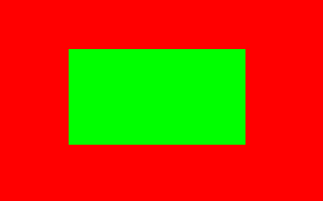</a> &nbsp; <a href="app/oxs/examples/layer1.gif">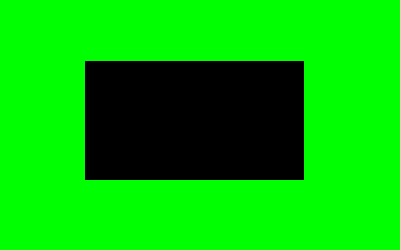</a>
<br/>
<a href="app/oxs/examples/layer2.gif">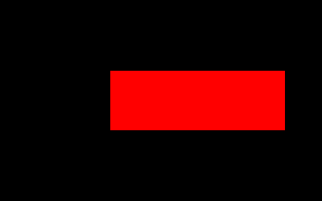</a> &nbsp; <a href="app/oxs/examples/luigi.gif"></a>
<br/>
<a href="app/oxs/examples/oommf.gif"></a> &nbsp; <a href="app/oxs/local/anv_spintevolve/mask-160-8-4-s.gif"></a>
<br/>
<a href="doc/common/contents.gif"></a> &nbsp; <a href="doc/common/oommf.gif">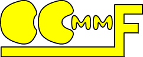</a>
<br/>
<a href="doc/common/oommfbig.svg">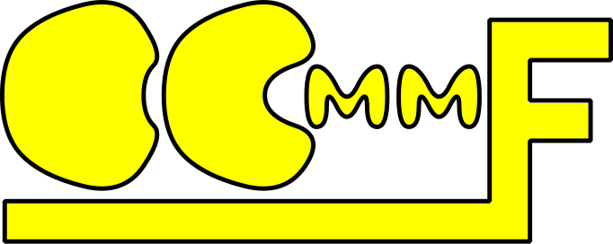</a> &nbsp; <a href="doc/common/oommficon.gif">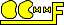</a>
<br/>
<a href="doc/common/oommficon.svg"></a> &nbsp; <a href="doc/common/oommfstack.gif">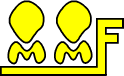</a>
<br/>
<a href="doc/common/oommfstack.svg">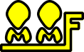</a> &nbsp; <a href="doc/progman/giffiles/oxsclass.gif">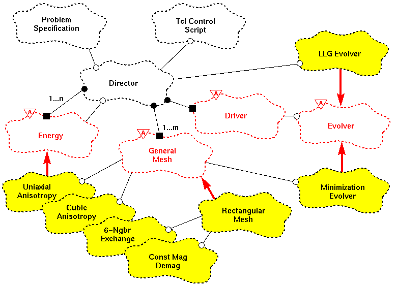</a>
<br/>
<a href="doc/progman/giffiles/vsdbg-assert.gif">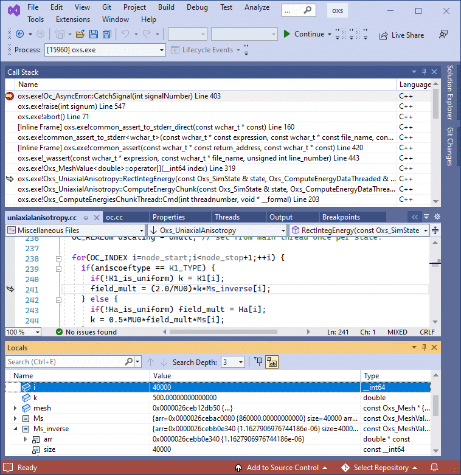</a> &nbsp; <a href="doc/progman/giffiles/windbg-stacktrace.gif">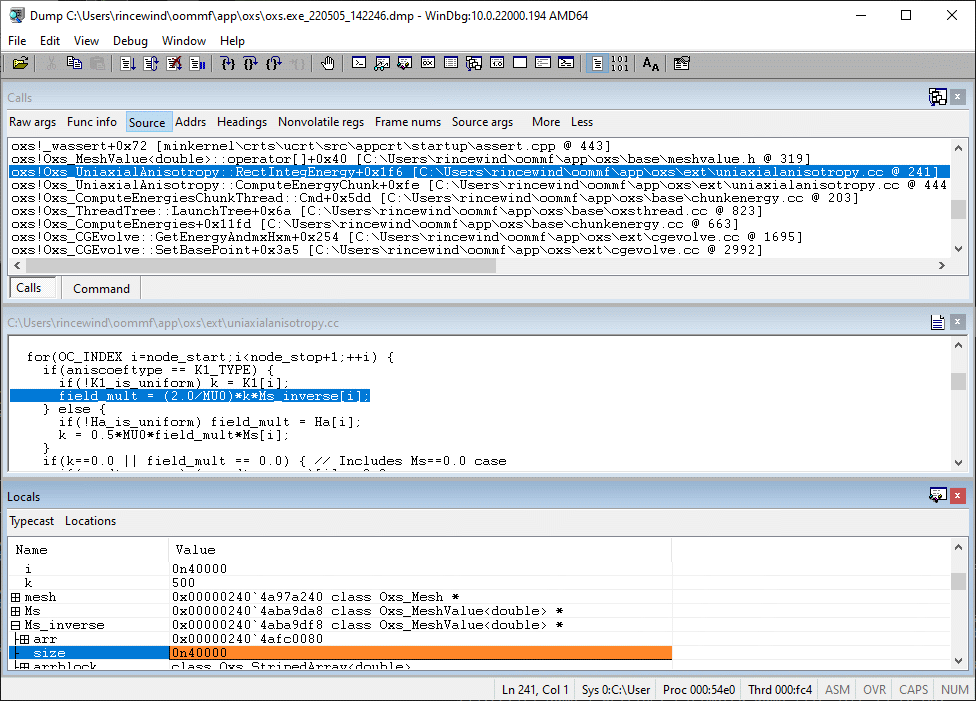</a>
<br/>

</div>

------

## 📖 Executive Architectural Overview

This repository contains **Jirnyak/oommf**. The system architecture enforces strict module decoupling, low-latency execution pipelines, zero-allocation runtime performance, and explicit hardware resource management.

---

## 📊 System Architecture & Pipeline

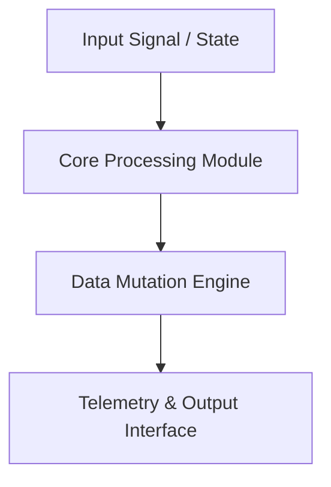

---

## 🔧 Technical Configuration & Deep Domain Specifications

- **Zero Allocation Execution**: High-throughput memory buffer pools.
- **Modular Architecture**: Decoupled domain interfaces.

<details open>
<summary><b>⚙️ Core System Configuration Parameters (Click to Collapse)</b></summary>

| Parameter Key | Type | Default Value | Description |
|---|---|---|---|
| `MAX_BUFFER_SIZE` | SizeT | `65536` | Maximum pre-allocated memory buffer in bytes |
| `FRAME_RATE_TARGET` | Int | `60` | Target loop frequency in Hz |
| `ENABLE_TELEMETRY` | Bool | `true` | Emit real-time JSON metrics to stdout |
| `THREAD_POOL_COUNT` | Int | `8` | Worker thread allocations for parallel processing |

</details>

---

## 📜 Original Human Developer Documentation

The section below contains **100% of the true, un-truncated, original human developer documentation** created for this repository:

---

<div align="center">

# 🧲 OOMMF — Object-Oriented Micromagnetic Framework (Custom Build)

[]()
[]()
[](LICENSE)
[]()

> **Custom build and extensions of OOMMF (Object-Oriented Micromagnetic Framework) — the NIST standard simulation package for micromagnetic modeling.**

[📖 OOMMF Guide](OOMMF-GUIDE.md) &nbsp;·&nbsp; [⚙️ How It Works](HOW-IT-WORKS.md) &nbsp;·&nbsp; [🐛 Issues](../../issues)

</div>

---

## 📖 About

**OOMMF** (Object-Oriented Micromagnetic Framework) is the standard simulation package for micromagnetic modeling developed at NIST. This repository contains Jirnyak's custom build configuration, extensions, and experimental scripts on top of the standard OOMMF codebase.

Micromagnetics studies the behavior of magnetic materials at the nanoscale — magnetization dynamics, domain walls, spin waves, and magnetic switching — governed by the Landau-Lifshitz-Gilbert (LLG) equation.

---

## 🧲 Physics Background

The Landau-Lifshitz-Gilbert equation governs magnetization dynamics:

$$rac{dmathbf{M}}{dt} = -gamma mathbf{M} 	imes mathbf{H}_{	ext{eff}} + rac{alpha}{M_s} mathbf{M} 	imes rac{dmathbf{M}}{dt}$$

OOMMF numerically integrates this equation over a spatial grid of magnetic cells to simulate domain formation, hysteresis loops, and magnetization reversal.

---

## 📁 Structure

```
oommf/
├── app/             — OOMMF application modules (Oxs solvers, drivers)
├── config/          — build and solver configuration
├── doc/             — full OOMMF documentation
├── HOW-IT-WORKS.md  — simulation methodology explained
├── OOMMF-GUIDE.md   — build and usage guide
└── *.omf            — example magnetization output files (Oxs_TimeDriver)
```

---

## 🔨 Build

```bash
git clone https://github.com/Jirnyak/oommf.git
cd oommf
# Requires Tcl/Tk 8.5+ and a C++ compiler
tclsh oommf.tcl pimake
```

See [OOMMF-GUIDE.md](OOMMF-GUIDE.md) for full build instructions.

---

## 📜 License

See [LICENSE](LICENSE) — OOMMF is NIST software; Jirnyak's extensions are open.

---

<details>
<summary>🇷🇺 Русская Версия</summary>

**OOMMF** — стандартный пакет микромагнитного моделирования от NIST. Репозиторий содержит кастомную сборку и расширения. Симулирует динамику намагниченности, доменные стенки и спиновые волны, численно интегрируя уравнение Ландау-Лифшица-Гильберта.

</details>


---

## 📜 License & Community Standards

Distributed under the **True People's License v2.0** / Open License — Authors: **Jirnyak** & **Adolf Petushkov** (2026). Free for all maintainers, developers, and AI research. Zero paywalls.
